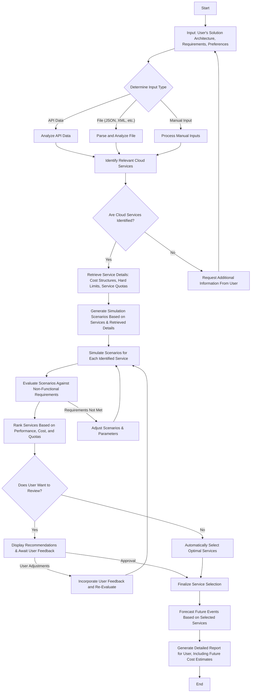

# CloudForecasts

CloudForecasts analyzes user-provided cloud solution architectures, identifying suitable cloud services and simulating various scenarios to evaluate performance, costs, and compliance with non-functional requirements. It ranks identified services, allows user adjustments, and forecasts future events, providing a detailed report with cost estimates. This enables informed decision-making for optimizing cloud-based solutions.

## How it Works

