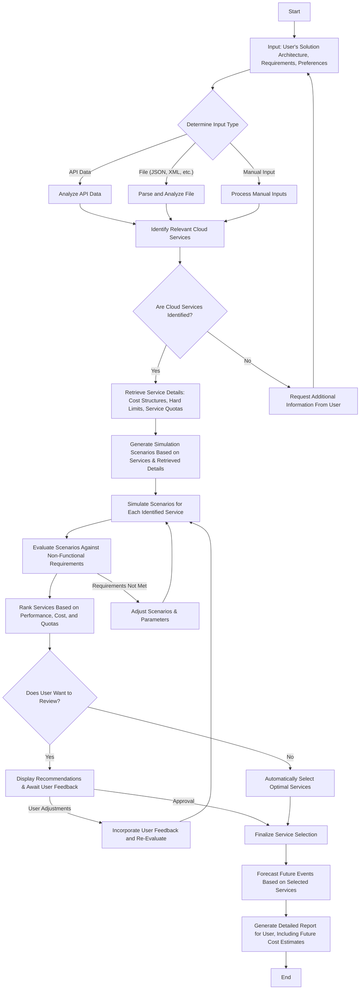

# CloudForecasts

## Why - The Purpose

CloudForecasts is designed to simplify the process of choosing the right cloud services for your projects. It acts as a personal advisor, helping you navigate through the complexities of cloud service selection to save you time and money.

## How - The Process

The approach is straightforward:

1. **Analyze Your Needs:** Start by sharing the details of your project or application.
2. **Identify Options:** CloudForecasts then identifies cloud services that match your requirements.
3. **Make Predictions:** Finally, it provides recommendations and future forecasts for these services.

## What - The Features

- **Flexible Input Methods:** Whether you prefer typing, uploading a file, or using an API, CloudForecasts accommodates your style.
- **Comprehensive Analysis:** It evaluates potential cloud services based on cost, limits, and regulations.
- **Personalized Recommendations:** You receive tailored suggestions and forecasts about the future performance of services.

---

## How It Works

Below is a brief overview of CloudForecasts' inner workings:

### Input Analysis

Your project information is the starting point. CloudForecasts is built to understand and process diverse types of input.

### Service Identification & Detail Retrieval

It then seeks out cloud services that fit your project's needs, gathering all necessary details to ensure a good match.

### Scenario Simulation & Evaluation

By simulating various scenarios, CloudForecasts tests the services to ensure they meet your needs, focusing on reliability and efficiency.

### Recommendations & Forecasting

In the end, you get a ranked list of services and insights into their future performance, helping you make an informed decision.

---

## Diagrams

For a clearer picture of how CloudForecasts operates, here are some diagrams:

### The Flow of CloudForecasts

### Understanding CloudForecasts Classes

```mermaid
classDiagram
    class CloudForecastsApp {
        -userSolution: SolutionArchitecture
        -requirements: Requirements
        -preferences: Preferences
        +parseInput(input: Input): ParsedInput
        +identifyCloudServices(parsedInput: ParsedInput): ServicesList
        +retrieveServiceDetails(servicesList: ServicesList): ServiceDetails
        +generateScenarios(serviceDetails: ServiceDetails): Scenarios
        +simulateScenarios(scenarios: Scenarios): SimulationResults
        +evaluateScenarios(simulationResults: SimulationResults): EvaluatedScenarios
        +rankServices(evaluatedScenarios: EvaluatedScenarios): RankedServices
        +forecastEvents(selectedServices: ServicesList): ForecastedEvents
    }

    class SolutionArchitecture {
        -components: Array
        -dataFlow: Array
        +addComponent(component: Component): void
        +removeComponent(componentId: String): Boolean
        +addDataFlow(from: Component, to: Component): void
        +removeDataFlow(from: Component, to: Component): Boolean
    }

    class Requirements {
        -nonFunctional: Array
        +addRequirement(requirement: Requirement): void
        +removeRequirement(requirementId: String): Boolean
    }

    class Preferences {
        -costPreference: String
        -performancePreference: String
        +setCostPreference(preference: String): void
        +setPerformancePreference(preference: String): void
    }

    class ServiceDetails {
        -costStructures: Object
        -hardLimits: Object
        -serviceQuotas: Object
        +addServiceDetail(service: String, details: Object): void
        +getServiceDetail(service: String): Object
    }

    class Scenarios {
        -list: Array
        +addScenario(scenario: Scenario): void
        +removeScenario(scenarioId: String): Boolean
    }

    class Scenario {
        -id: String
        -description: String
        -successCriteria: Object
    }

    class SimulationResults {
        -results: Array
        +addResult(scenarioId: String, result: Object): void
        +getResult(scenarioId: String): Object
    }

    class EvaluatedScenarios {
        -evaluations: Array
        +addEvaluation(scenarioId: String, evaluation: Object): void
        +getEvaluation(scenarioId: String): Object
    }

    class RankedServices {
        -rankings: Array
        +addServiceRank(service: String, rank: Number): void
        +getServiceRank(service: String): Number
    }

    class ForecastedEvents {
        -events: Array
        +addEvent(service: String, event: Object): void
        +getEvent(service: String): Object
    }

    CloudForecastsApp --> SolutionArchitecture
    CloudForecastsApp --> Requirements
    CloudForecastsApp --> Preferences
    CloudForecastsApp --> ServiceDetails
    CloudForecastsApp --> Scenarios
    CloudForecastsApp --> SimulationResults
    CloudForecastsApp --> EvaluatedScenarios
    CloudForecastsApp --> RankedServices
    CloudForecastsApp --> ForecastedEvents
```

---

## Getting Started

Here's how to begin with CloudForecasts:

1. **Set Up:** Download and install CloudForecasts on your device.
2. **Input Project Details:** Share the specifics of your project and what you're looking for.
3. **Receive Recommendations:** Explore the suggestions to find the best cloud service options for you.

Interested in optimizing your cloud service selection? Give CloudForecasts a try today!
