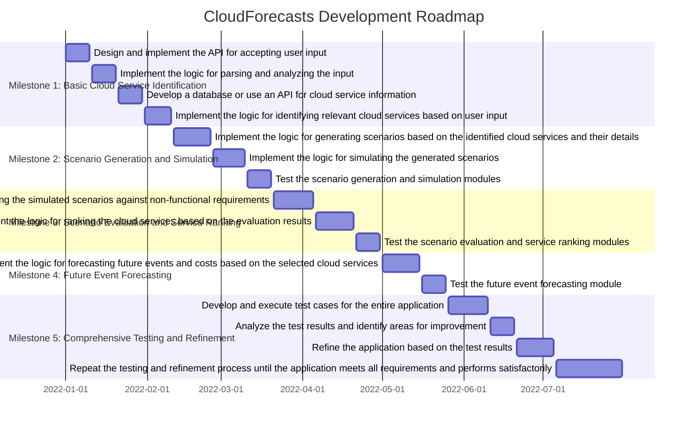

# Roadmap

This document presents a strategic roadmap for developing CloudForecasts. It is structured around five key milestones, with each aiming to deliver a Minimum Viable Product (MVP) that upholds:

- **Efficiency**: Streamlining processes for faster development cycles.
- **Reliability**: Ensuring stability and performance of each MVP.
- **Continuous Improvement**: Iteratively enhancing features based on user feedback and performance metrics.

## Approach

Our approach leverages the DORA Core Model’s metrics as guideposts to optimize the development lifecycle, focusing on:

1. **Deployment Frequency**: Aim to increase the number of deployments to deliver features more frequently.
2. **Lead Time for Changes**: Reduce the time it takes to go from code commit to code successfully running in production.
3. **Time to Restore Service**: Minimize the time required to recover from a failure.
4. **Change Failure Rate**: Decrease the percentage of deployments causing a failure in production.

By committing to these metrics, we aim to:

- Accelerate the lead time for changes.
- Enhance deployment frequency.
- Lower the change failure rate.
- Ensure swift service restoration.

## Using the Roadmap

### Project Managers and Team Leads

- **Plan and Allocate**: Align project goals with resources and priorities.
- **Track and Adjust**: Use it to monitor progress and update plans as needed.
- **Communicate**: Share updates and changes with stakeholders for transparency.

### Development Teams

- **See the Big Picture**: Understand how your work fits into overall goals.
- **Focus and Prioritize**: Use milestones for guidance on what to achieve next.
- **Provide Feedback**: Offer insights to refine the roadmap.

### Individual Contributors

- **Align Goals**: Match your personal goals with project objectives.
- **Self-Manage**: Prioritize tasks based on the roadmap’s structure.
- **Learn and Share**: Identify opportunities for skill development and collaboration.

### General Guidance

- **Adapt and Update**: Treat the roadmap as evolving based on feedback and progress.
- **Collaborate**: Use it as a basis for discussion and collective effort towards common goals.

Engaging with this roadmap actively and collaboratively will help steer CloudForecasts towards achieving its strategic milestones efficiently and effectively.

## Our Timeline

## Milestones

### Milestone 1: Basic Cloud Service Analysis Tool

**Objective:** Develop a basic version of CloudForecasts capable of analyzing user input to identify relevant cloud services.

- **Goal 1: Establish Development Environment**
  - Task: Set up version control (Git).
  - Task: Configure CI/CD pipelines.
  - Task: Select and set up development tools and frameworks.
- **Goal 2: Input Processing**
  - Task: Implement API, file upload, and manual input parsing functions.
  - Task: Create a basic UI for manual input.
- **Goal 3: Cloud Service Identification**
  - Task: Develop a stub function for identifying cloud services based on input.
  - Task: Integrate a basic database of cloud services for identification purposes.
- **Goal 4: Initial Testing and Deployment**
  - Task: Write unit tests for input processing and service identification.
  - Task: Deploy the application to a staging environment.

**DORA Metrics Focus:** Deployment Frequency, Lead Time for Changes.

### Milestone 2: Scenario Generation and Simulation

**Objective:** Enhance CloudForecasts with the ability to generate scenarios based on identified services and simulate these scenarios.

- **Goal 1: Service Detail Retrieval**
  - Task: Implement functions to retrieve service details (cost, limits, quotas).
  - Task: Populate the service database with detailed information.
- **Goal 2: Scenario Generation**
  - Task: Develop functionality to generate scenarios based on service details.
- **Goal 3: Scenario Simulation**
  - Task: Implement simulation logic for generated scenarios.
- **Goal 4: Testing and Iteration**
  - Task: Write integration tests for scenario generation and simulation.
  - Task: Deploy updates and gather feedback from a select user group.

**DORA Metrics Focus:** Lead Time for Changes, Change Failure Rate.

### Milestone 3: Evaluation and Ranking System

**Objective:** Implement a system to evaluate scenarios against non-functional requirements and rank services.

- **Goal 1: Scenario Evaluation**
  - Task: Develop evaluation criteria based on non-functional requirements.
  - Task: Implement scenario evaluation logic.
- **Goal 2: Service Ranking**
  - Task: Create a ranking algorithm based on performance, cost, and quotas.
- **Goal 3: Enhanced Testing and Feedback Loop**
  - Task: Conduct comprehensive testing, including performance and stress tests.
  - Task: Collect and incorporate user feedback for improvements.

**DORA Metrics Focus:** Time to Restore Service, Change Failure Rate.

### Milestone 4: Forecasting and Reporting

**Objective:** Add forecasting of future events and costs based on selected services and generate comprehensive reports.

- **Goal 1: Future Events Forecasting**
  - Task: Implement forecasting algorithms for future events and costs.
- **Goal 2: Report Generation**
  - Task: Develop functionality for generating detailed reports for users.
- **Goal 3: User Experience Enhancement**
  - Task: Refine UI/UX based on user feedback.
  - Task: Implement additional feedback mechanisms within the app.

**DORA Metrics Focus:** Deployment Frequency, Lead Time for Changes.

### Milestone 5: Optimization and Scaling

**Objective:** Optimize CloudForecasts for performance and scalability, ensuring it can handle a large number of users and complex scenarios.

- **Goal 1: Performance Optimization**
  - Task: Optimize code for speed and efficiency.
  - Task: Implement caching and other performance-enhancing techniques.
- **Goal 2: Scalability**
  - Task: Ensure the architecture supports scaling, both vertically and horizontally.
  - Task: Test scalability under load.
- **Goal 3: Final Testing and Launch**
  - Task: Conduct final round of testing, covering all aspects of the application.
  - Task: Prepare and execute the launch plan.

**DORA Metrics Focus:** All metrics, with a particular focus on ensuring reliability and efficiency at scale.
